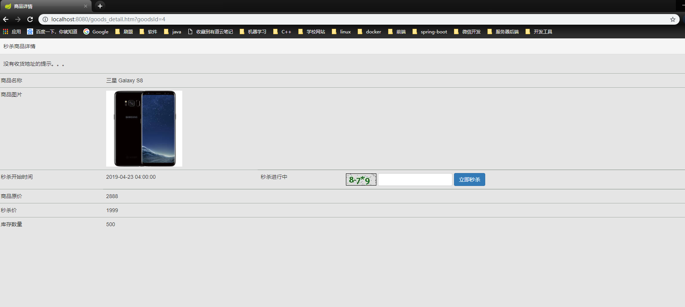
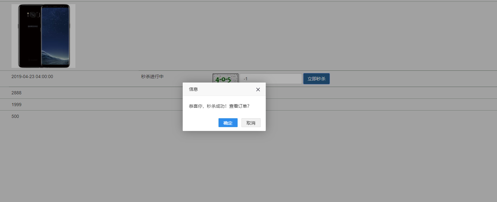
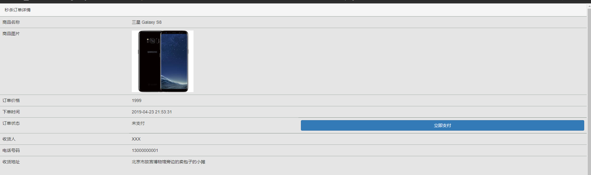
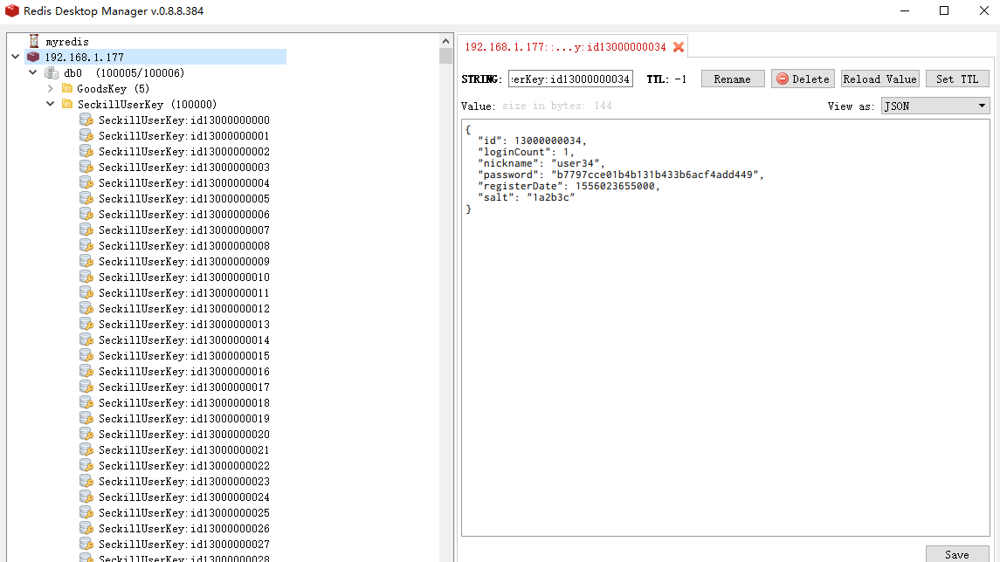

# seckill

注意：此网站为技术交流学习网站,**并非真实商城**

## 介绍

一个基于java技术的手机秒杀网站，这个项目是根据我在慕课网上面学习的几个课程，整合几门课的知识内容实现的一个学习项目，并且原来上课的老师们使用的都是Spring Boot 1.x 版本，我实现项目时使用的是 Spring Boot 2.x 版本。

本项目基于REST风格，实现前后端分离。

实践本项目的主要目的是为了学习高并发和分布式中间件相关的只是：

​	1、高并发点和高并发分析

​	2、优化思路

​	3、代码实现

​	4、测试

## 结果演示

1、用户登录

2、商品列表

3、商品详情页

4、秒杀成功通知

5、生成订单（模拟，并不具备支付功能，准备进一步改进）

6、管理后台

​		正在开发中

7、jMeter压测

聚合报告小示例：可以看出数据库QPS很低。

并发量大之后会出现的错误：

因为用的是windows安装虚拟机的方式，所以会出现这个问题，原因是windows本身提供的端口访问机制的问题。

Windows 提供给 TCP/IP链接的端口为 1024-5000，并且要四分钟来循环回收他们。就导致我们在短时间内跑大量的请求时将端口占满了。

8、redis 

​	分布式session 用来存储用户登录信息，

​	下图表示我在0号DB中存储了100000个用户session。

 

## 工具

IDEA(Eclipse)+Maven

VirtualBox +centos7 (注：有真实服务器更好，本人因为硬件条件原因，压测效果不是很理想)

Redis Desktop Manager：redis客户端可视化软件

Mysql Workbench：mysql免费可视化管理软件

jMeter：压测工具，用于对网站进行压力测试

lombok : lombok是一个可以通过简单的注解的形式来帮助我们简化消除一些必须有但显得很臃肿的 Java 代码的工具，

推荐一个前端页面代码生成的网站：

http://www.ibootstrap.cn/

## 技术栈

- Spring Boot 2.X

- MyBatis

- Redis, MySQL

- Thymeleaf 

- RabbitMQ

- Durid

- Bootstrap

- Ajax

- jQuery

- javaScript

  

## 架构图

进行中。。。

## 秒杀过程

## 压测及问题分析

## 优化

