# seckill

注意：此网站为技术交流学习网站,**并非真实商城**

## 介绍

一个基于java技术的手机秒杀网站，这个项目是根据我在慕课网上面学习的几个课程，整合几门课的知识内容实现的一个学习项目，

课程如下：

《Java秒杀系统方案优化 高性能高并发实战》--学习秒杀高并发方面的各种技术

《Spring Boot企业微信点餐系统》--主要是后台系统（其他内容也学了，但是并没有在项目中用到）

《 Java从零到企业级电商项目实战》--支付宝当面付（虽然我用的是支付宝PC网站支付，但是可以借鉴一下）

主要是基于 joshua 老师的《Java秒杀系统方案优化 高性能高并发实战》这门课。学习到的一些高并发系统的开发过程以及许多的优化知识，除此之外还有很多很好的编写代码的习惯，非常感谢。另外两门课也都借鉴了一些，此外还看了很多的博客和支付宝支付的文档，在此感谢所有上课的老师，给了我们一个学习的机会。

此外，原来上课的老师们使用的都是Spring Boot 1.x 版本，我实现项目时使用的是 Spring Boot 2.x 版本。

实本项目的主要目的是为了学习高并发和分布式中间件相关的知识：

​	1、高并发点和高并发分析

​	2、优化思路

​	3、代码实现

​	4、测试

## 结果演示

#### 用户界面展示：

1、用户登录

【注】该项目已部署到阿里云服务器，感兴趣的朋友可以登录http://47.105.160.177:8080/login/to_login 进行体验。

用户名：13000000000-13000009999 之中随便一个

密码：123456

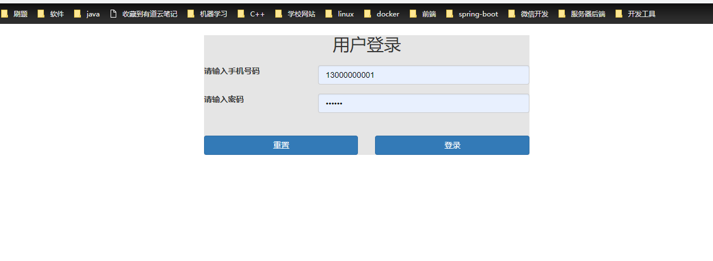

2、商品列表

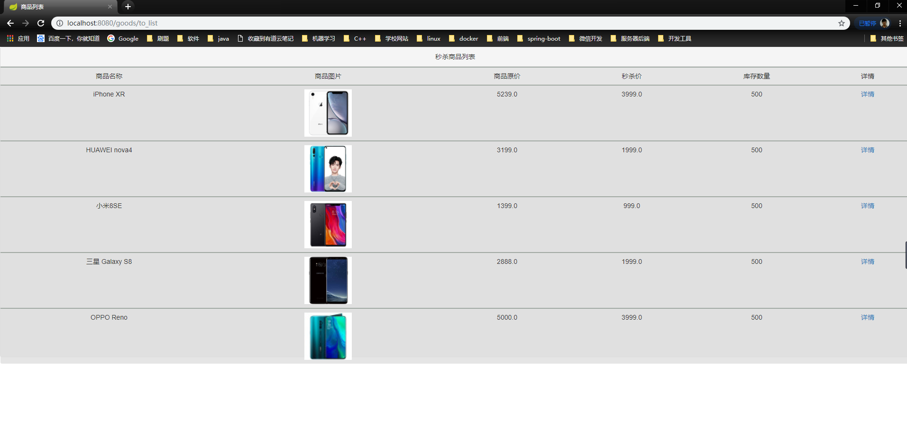

3、商品详情页

​		防止机器人刷单，所以设立了验证码

4、秒杀成功通知

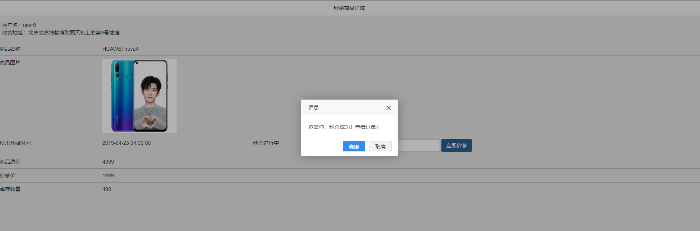

5、生成订单

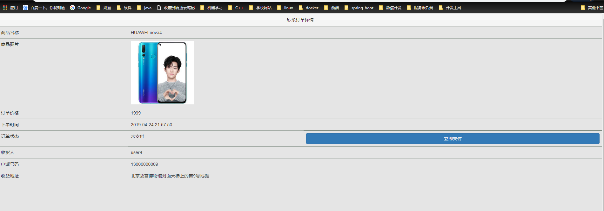

6、订单支付

​		我这里实现的是支付宝的网站支付功能。采用的是沙箱账户进行测试，所以如果朋友们想要测试的话可以去支付宝开发者官网上去下载一个沙箱钱包，会提供专门的沙箱账号用于测试。

​	我在测试的过程中发现一个bug,即扫码支付，偶尔可能会直线支付成功了，并且验证成功了，但是页面却没有跳转的情况。这个我们就没办法了，因为从跳出去支付页面到最后跳转回制定的页面的过程中。都是支付宝第三方在控制。当然如果你是用账号密码登录，则不会出现问题。猜测应该是沙箱的不稳定导致的偶尔出错（官网有提示，沙箱可能不稳定）。

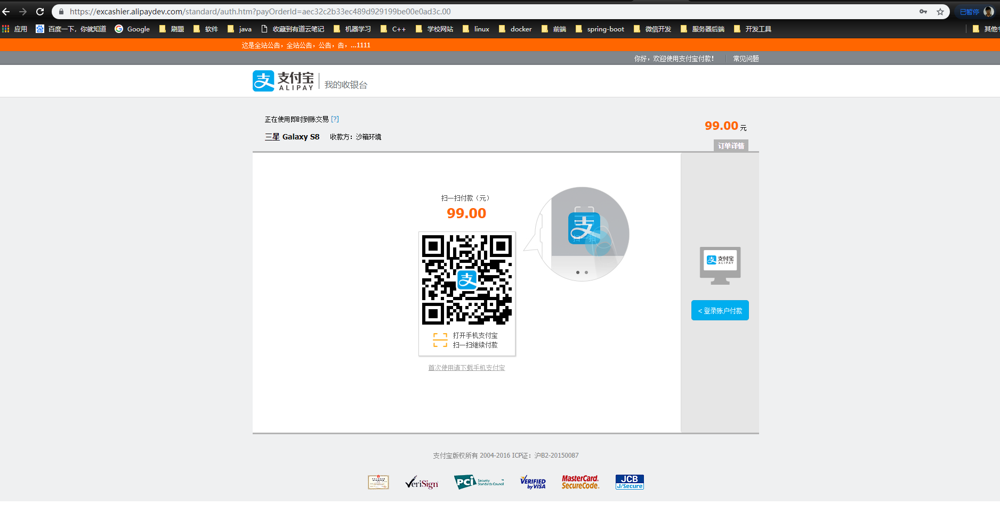

付款成功

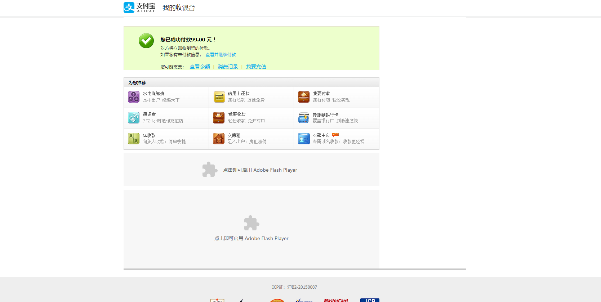

支付订单详情

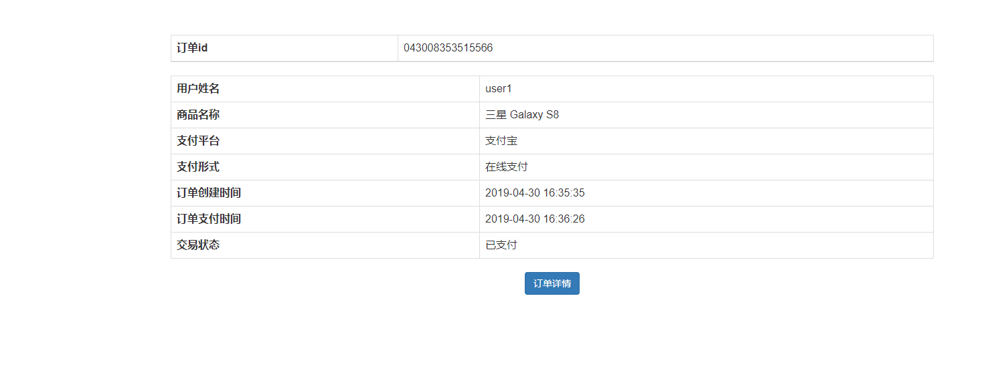

返回继续秒杀

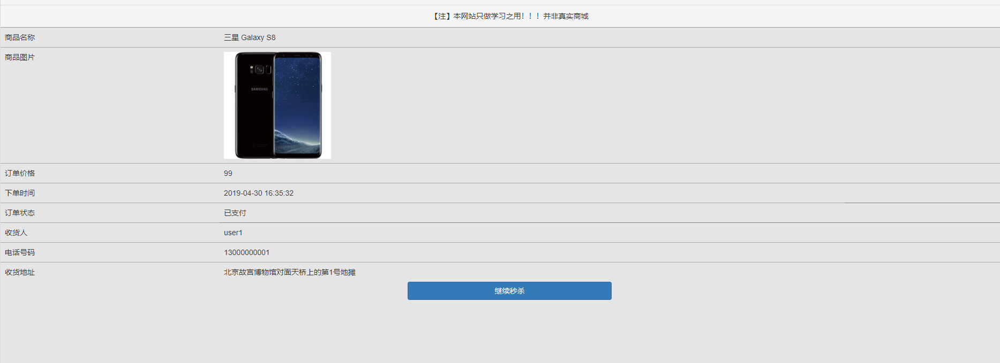

#### 后台管理后台展示

功能描述：一个具备完整的订单管理功能，商品管理功能，秒杀商品管理功能的后台管理系统。

后台登录地址：

http://47.105.160.177:8080/admin/login  感兴趣的朋友可以进去体验一下

登录界面

用户名: admin

密码：admin

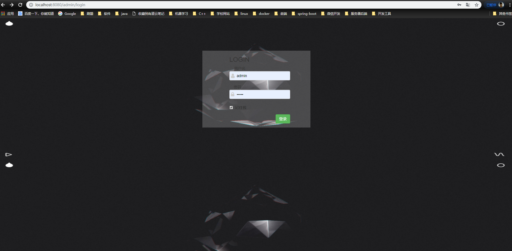

​		订单管理

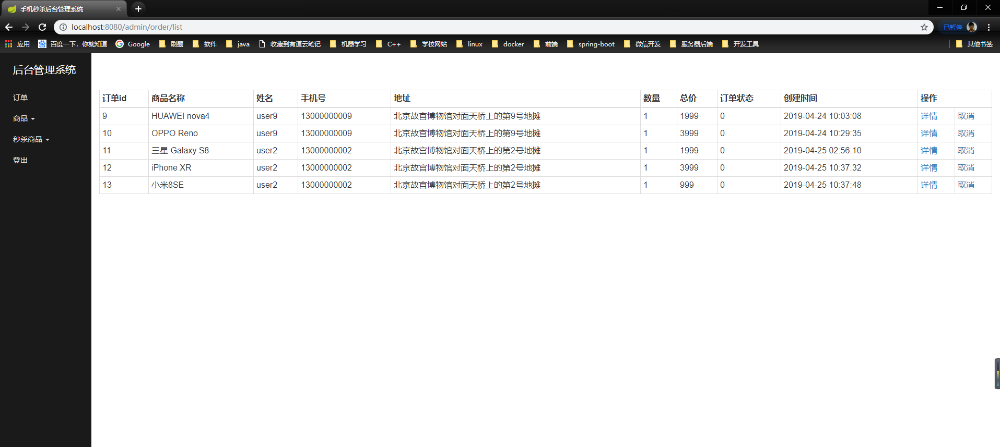

订单处理

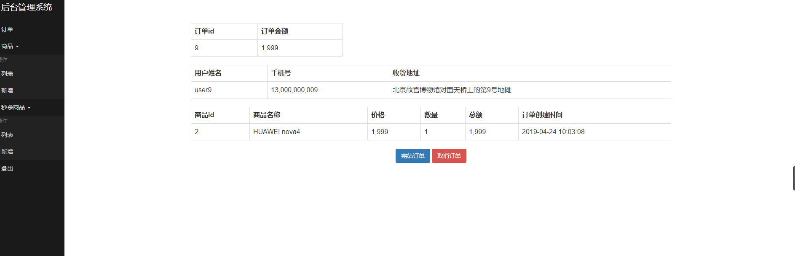

商品列表

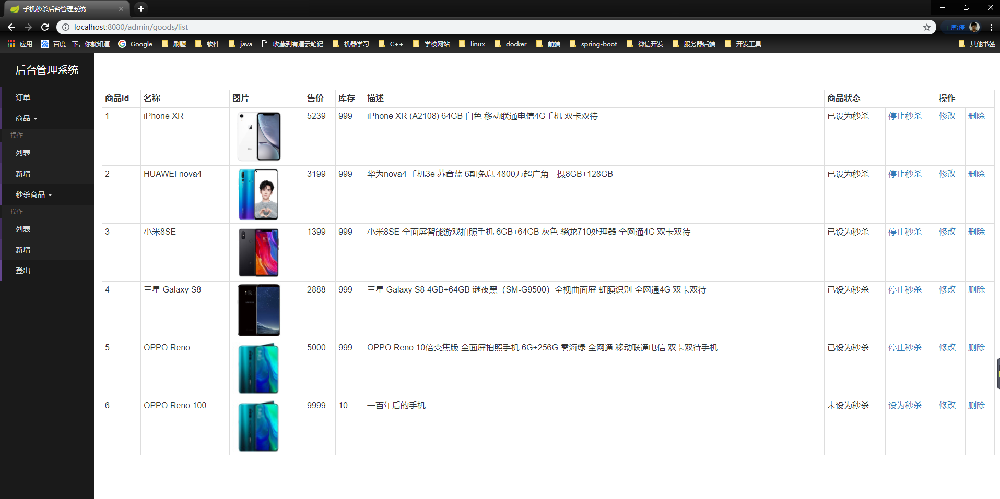

商品信息修改：

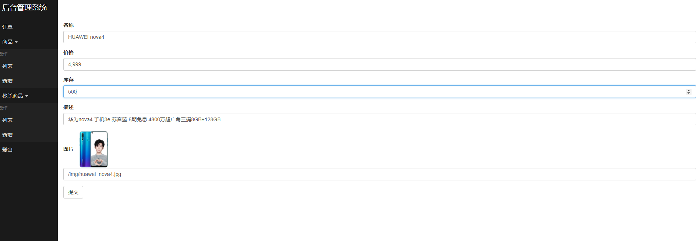

商品新增

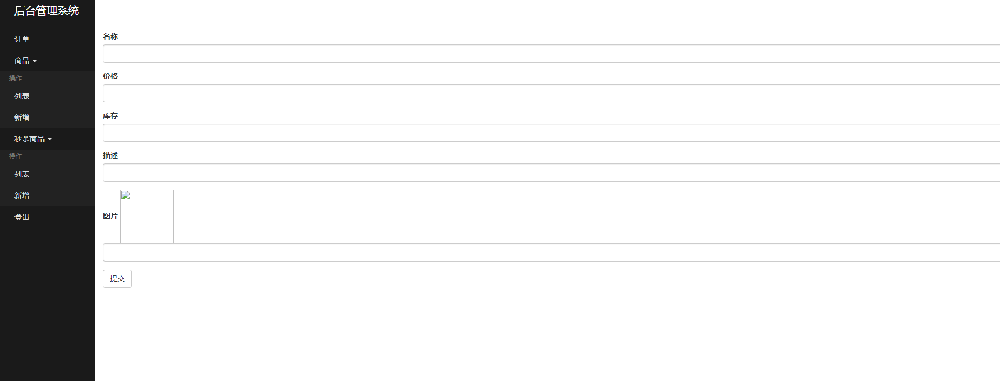

秒杀商品列表

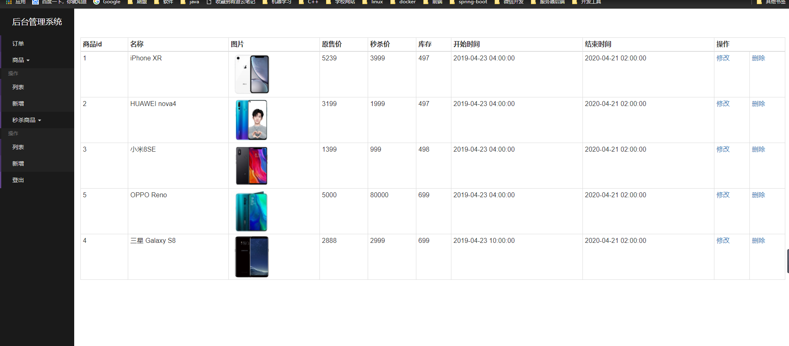

秒杀商品信息修改

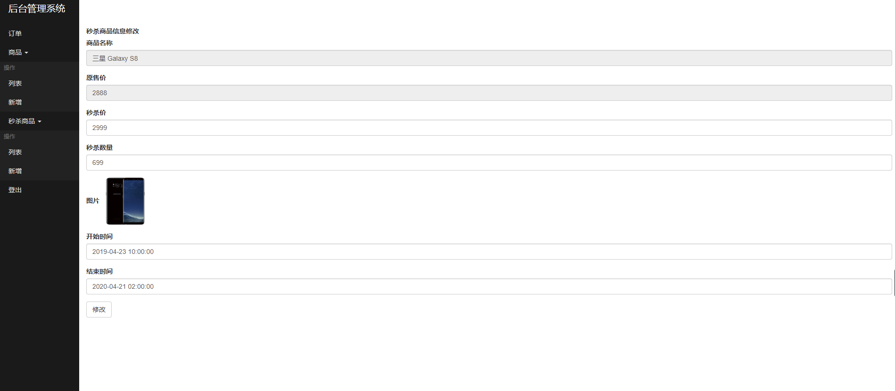

## 工具

IDEA(Eclipse)+Maven

VirtualBox +centos7 (注：有真实服务器更好，本人因为硬件条件原因，压测效果不是很理想)

Redis Desktop Manager：redis客户端可视化软件

Mysql Workbench：mysql免费可视化管理软件

jMeter：压测工具，用于对网站进行压力测试

lombok : lombok是一个可以通过简单的注解的形式来帮助我们简化消除一些必须有但显得很臃肿的 Java 代码的工具，

推荐一个前端页面代码生成的网站：http://www.ibootstrap.cn/

ProcessOn：一个画架构图以及各种图的软件

## 技术栈

- Spring Boot 2.X

- MyBatis

- Redis, MySQL

- Thymeleaf 

- freemarker

- RabbitMQ

- Durid

- Bootstrap

- Ajax

- jQuery

- javaScript

  【注】前端技术不怎么熟，所以在做项目的时候被ajax虐了一边又一遍。不过最后终于还是勉强能用于开发了。
  
  后端模板的话。Thymeleaf 和freemarker都试了下，发现还是比较喜欢freemarker。觉得比较简洁。

## 架构图

【注】：图中的只是一个比较传统的思路，你也可以使用单机版本，但是如果不搭建集群的话，比如redis挂了，整个系统就死了。所以测试用单机。生产环境必须集群。

架构图我是使用ProcessOn画的，你也可以使用draw.io画。主要是Azure这个图形包。那两个工具都很推荐！

## 秒杀过程

​	根据架构图分析一下，

​	1、首先用户通过任意渠道访问我们的网站，然后根据一定的路由规则（比如对用户的ID进行hash）被分配到某个服务器接受服务。（我这里没有用Nginx做负载均衡，但实际应该要做的，不然所有用户都访问同一个服务器，负载			太大。）

​	2、当用户进行秒杀时，因为考虑到同一个时刻，并发量可能会特别大。所以不能让服务器直接访问DB，不然DB很容易挂掉，所以应该使用redis加缓存。用户在秒杀的时候在Redis中预减库存减少数据库的访问，同时使用内存标记减少redis的访问，（redis的处理能力也是有限的，负载太大也是会宕机的，所以这里也要进行Redis的保护，即加一个标记变量记录是否还有商品，如果商品已经没有了，那就置位，这样的话，后续的请求就不会去访问redis然后直接返回秒杀失败）。

​	3、RabbitMQ队列缓冲，异步下单。因为服务器处理下单涉及DB的读写，当并发量很大的时候，需要很多时间，从而用户体验会很不好，因为需要等待很久才知道结果。所以采用消息队列异步下单。即如果用户秒杀成功，那么创建的订单并不直接写入DB。而是给rabbitmq发送一条message.然后就直接返回给用户说下单成功。然后由监听消息队列的消费者根据接收到的消息，创建订单并写入DB.这里为了提高效率，可以使用一个线程池来解决并发及连接复用的的问题。

​	4、用户下单完成后，点击订单详情可以查看订单详情，然后选择立即支付。 可以使用支付宝支付，因为时测试，所以使用的是沙箱环境。想体验的朋友可以下载沙箱钱包来测试一下。支付完成后，可以回到商品列表继续秒杀。

## 压测及问题分析

#### jMeter压测

聚合报告小示例：可以看出直接访问数据库，吞吐量很低。

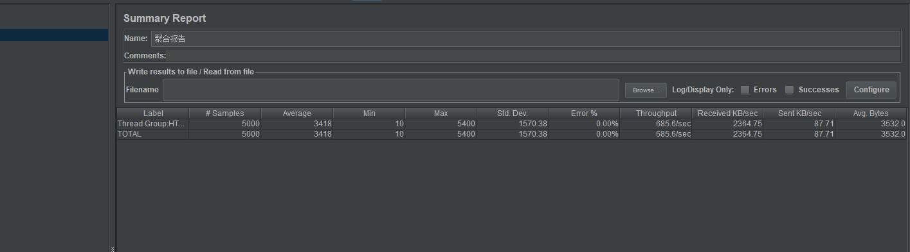

并且在这种情况下。并发量大之后会出现的错误：

因为用的是windows安装虚拟机的方式，所以会出现这个问题，原因是windows本身提供的端口访问机制的问题。

Windows 提供给 TCP/IP链接的端口为 1024-5000，并且要四分钟来循环回收他们。就导致我们在短时间内跑大量的请求时将端口占满了。

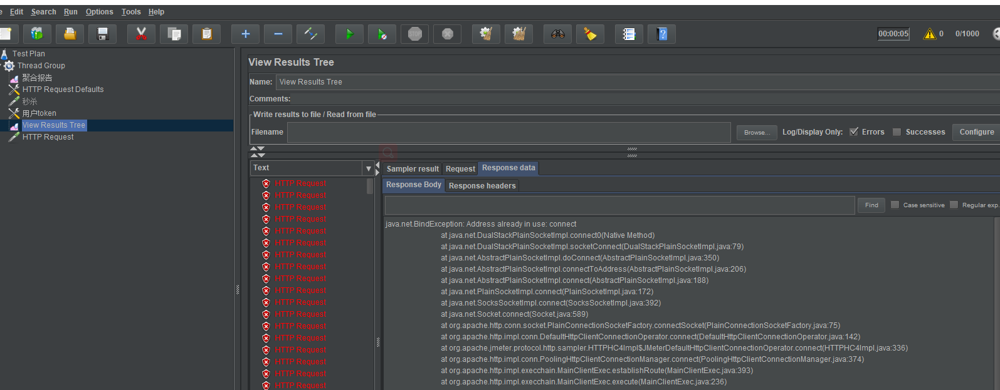

## 优化

因为高并发系统瓶颈在数据库：

​	根本解决方案加缓存！！！在保证数据一致性的前提下加缓存！

页面优化技术：

​	1、页面缓存+URL缓存+对象缓存

​			因为内存redis里面比DB要快，所以最好加各种各样的缓存，尽量少访问DB。 

​			对象级缓存，如果有更新一定要记得把数据库和缓存一起更新，这样的才能保证数据一致性。

​	2、页面静态化，前后端分离

​			最近比较火的，Restful 风格：前后端分离，在本项目中前端就是html+Ajax ，只传输动态参数，也就是VO对象。然后前端拿到数据后通过Ajax进行渲染。把页面等静态资源缓存在客户端，这样前端和后端之间的交互就只传输需要的参数就行。并不需要后端模板引擎吧页面渲染好然后把整个页面传到前端，极大的减少了服务器的压力和网络带宽的压力。

​	3、静态资源优化

​			js/css压缩，减小流量。

​			多个js/css组合。减少连接数。

​	4、CDN优化（未涉及）

接口优化技巧：

​	1、Redis预减库存减少数据库的访问。

​	2、内存标记减少Redis访问。（即：如果预减库存那一步已经把flag置位，表示没有商品了。那就不应该访问redis了。这样以后的请求就可以直接返回秒杀失败，从而减少redis的压力）。

​	3、RabbitMQ队列异步下单，增强用户体验。原理见：秒杀过程

安全优化：

​	1、秒杀接口地址隐藏：

​			为了防止别人提前得到接口，通过机器人来刷单。所以必须得等到秒杀开始时候才能点击按钮，此时再去请求真正的地址。然后再进行秒杀。

​	2、数学公式验证码：

​			数学验证码或者其他什么选字验证码之类的，主要是也是为了防止机器人刷单比如按键脚本什么的。但是对于用户来说的话不太友好。因为太麻烦了。所以这个看情况使用。

​	3、接口防刷

​			主要就是防止按键脚本之类的。疯狂点击秒杀按钮。这样疯狂发送请求的话，容易给服务器带来很大的压力。所以我们对每个用户进行了限定。比如每个用户1秒钟内或者3秒钟内只能点击5次按钮。超过规定的次数。就返回点击太频繁的异常提示。后台接口不处理业务，直接返回异常。这样的话可以很大程度上减少服务器的压力。

​	具体实现：使用redis缓存服务存储每个user在一段时间内的访问次数。设置一个key和过期时间。如果在过期时间内次数超过规定次数，那就返回点击频繁异常。不进行任何操作。

